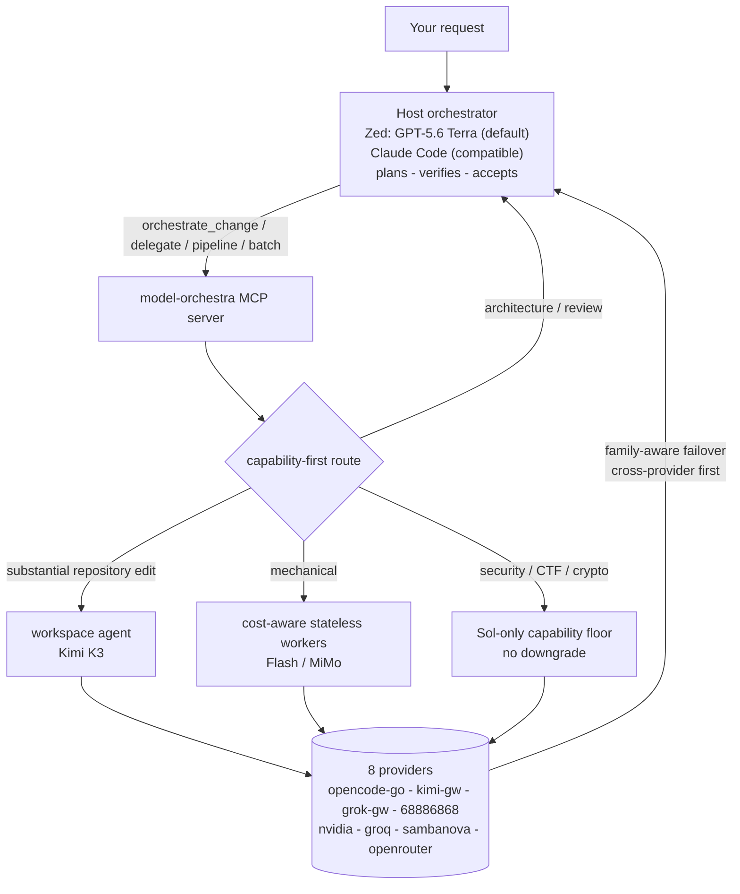
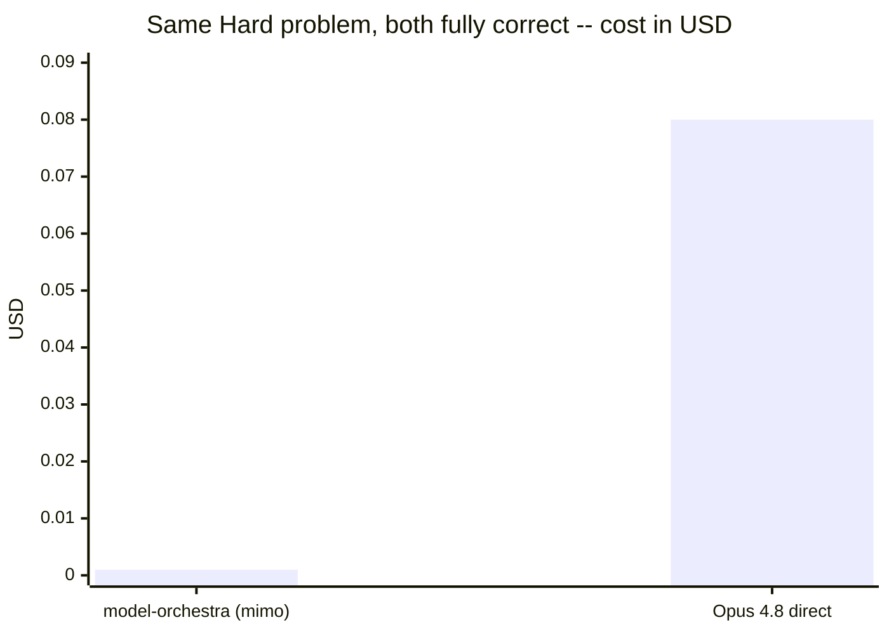
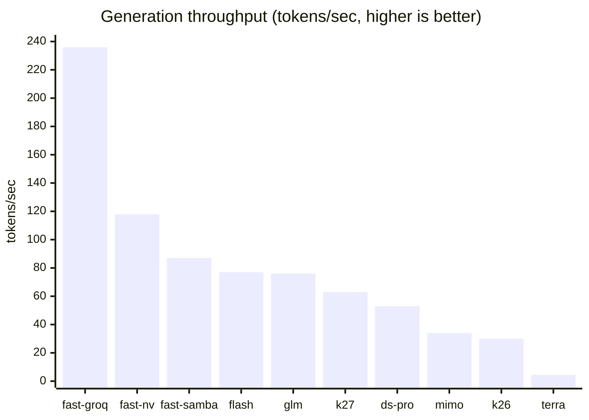
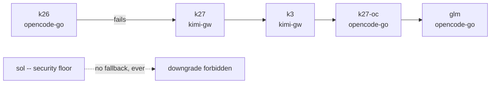
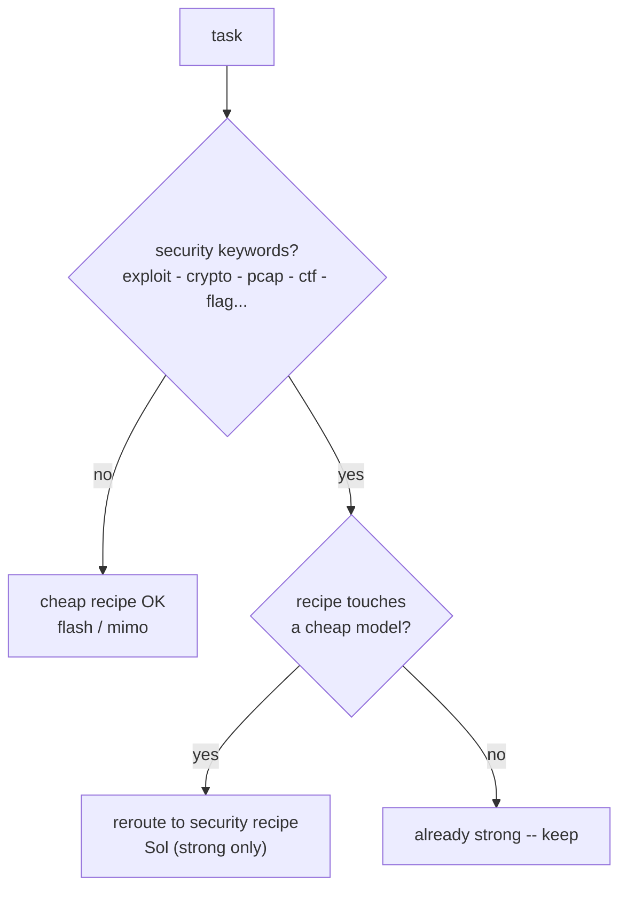

# model-orchestra

**Primary orchestrator:** Zed with GPT-5.6 Terra for planning, review, and acceptance.
**Compatible secondary host:** Claude Code. GPT-5.6 Sol handles security-sensitive
reasoning, while Kimi K3 is the default workspace implementation worker for
substantial repository changes. Tiny models on OpenRouter, NVIDIA, OpenCode Go,
Groq, and SambaNova remain workers for bounded stateless work.

Zed selects GPT-5.6 Terra as the default host model in its assistant settings.
`AGENTS.md` supplies the orchestrator behavior instructions. `.mcp.json`
registers the model-orchestra MCP tools; it cannot and does not select the host
model.

Why an MCP tool and not native subagents: subagents can only run the vendor's
own models. Delegating to other providers has to go through a tool. This is it.



**19 worker aliases across 8 providers.** Generation caps, budget envelopes, swarm
size, batch size, judge input, and a wall-clock deadline on every call are all
bounded in `config.json`.

## Measured results

All numbers below come from live API calls on 2026-07-21, verified by executing the
generated code. Aliases, prices, and provider speeds change -- rerun before trusting
them for a current decision.

### 1. Historical head-to-head: Opus 4.8 vs a cheap worker

This is retained as historical evidence, not the current cost claim. The current
Zed host is Terra; live Terra end-to-end costs are reported by `tools/benchmark.py`
and `tools/proof.py`.

LeetCode 4 (Median of Two Sorted Arrays) -- Hard, with a strict O(log(m+n))
requirement so a lazy merge-and-sort is detectable. 52 shared cases: empty arrays,
duplicates, negatives, wildly uneven lengths, plus randomized fuzz.

| | Correct | Took the merge+sort shortcut | Cost |
|---|---|---|---|
| **Opus 4.8**, written directly | **52/52** | no | ~$0.08 host-equivalent |
| **model-orchestra** (`mimo`) | **52/52** | no | 16 IDR (~$0.001) |



At those historical prices, worker generation was ~80x cheaper at identical
correctness. That ratio must not be applied to the current Terra host.

### 2. Quality: 5/6 typical, and it is the token cap that decides

`python tests/test_quality.py` executes every generated artifact against real checks.

| `worker_max_tokens` / `judge_max_tokens` | Pipeline quality |
|---|---|
| 1024 / 1536 | **1/6** -- workers truncated mid-function; judges then described the fragments |
| 3072 / 4096 | **5/6 typical (4-6/6 across runs)** |

`max_tokens` is a **cap, not a charge** -- a short answer costs the same either way.
Lowering it saves almost nothing and silently guts output. A startup assertion now
refuses to boot below 2048. Runs vary because `speed-run` is nondeterministic; the
one task that flaps is usually the *easiest*, not the hardest.

### 3. Speed: model choice dominates, not code

Measured throughput, identical 1500-token generation per worker:



`draft-refine` used to run slower workers on its critical path. Its explicit
capability recipe now uses `flash`/`glm` (~77/76 tok/s), but cost-aware auto routing
normally chooses one-shot Flash or direct Terra because the two-call recipe is not a
cost-saving default. Terra remains the host for judgment-heavy work.

Three latency bugs fixed, each measured:

| Fix | Before | After |
|---|---|---|
| `request_timeout` 60s was aborting live generations, forcing retries | 181s, 3 attempts | **52.9s, 0 retries** |
| `compact()` summarized chunks serially | 3.0s / 10 chunks | **0.90s (3.3x)** |
| Retry+failover had no wall-clock bound | ~27 min worst case | **bounded, verified 13.6s** |

### 4. Verification: supply your own tests, never let the worker write them

`delegate_verified` runs generated code against tests and retries with the real
failure output. **Which tests you use decides whether it helps or hurts.**

| Mode | Actually correct (hidden checks) | Output tokens | Wall time |
|---|---|---|---|
| Plain `speed-run`, 24 tasks | **23/24 (96%)** | 15,499 | 43s |
| Worker writes its own tests | **18/24 (75%)** | 84,572 (5.5x) | 158s |
| Caller supplies tests | verified in 1 attempt | -- | 9.3s |

Self-written tests are **worse than not verifying at all**: forcing implementation
and tests into one response splits the token budget, and the retry loop then
"fixes" working code against the model's own bad tests. It also once reported
`VERIFIED` for code that failed independent checks -- confidently wrong, the worst
failure mode there is.

Pass real tests in the `tests` argument. They are the one specification a worker
cannot game. `pipeline()` and `auto_delegate()` accept the same contract, test the
final pipeline artifact first, and call a repair model only after a real failure:

```python
pipeline(
    "Write add(a, b)",
    mode="draft-refine",
    tests="def test_add():\n    assert add(2, 3) == 5",
)
```

Verification intentionally rejects missing tests and `agent=True`. With
`escalate=True`, it tries the original worker, one same-model repair, then the
configured stronger model only after another real test failure. Sol never downgrades.
Generated code runs in a temporary directory with a timeout, but it is not an OS
sandbox; use only trusted task descriptions and tests.

### 5. Batching: return a manifest, not the code

Everything a batch returns lands in the **host's** context at host rates. Batches
therefore write artifacts beneath the supplied workspace and return a manifest by
default. Set `inline=True` only when Terra genuinely needs every result in context;
`out_dir` selects a workspace-contained destination. Measured on a 3-task batch:
1,932 chars inline vs 272 as a manifest, **86% less host context**, and the
manifest stays roughly flat as the batch grows. The current offline benchmark uses
larger synthetic artifacts and measures **95.5% less returned host context**; this is
context suppression, not a billed-cost claim.

### 6. Cost: current-host accounting and prompt caching

The current comparison host is Zed's GPT-5.6 Terra at the configured IDR rates.
`cost_report()` reports measured worker cost, a conservative Terra re-ingestion
ceiling, direct-Terra equivalent cost, and net saving. `orchestrate_change()` applies
capability before economics: substantial repository implementation selects the K3
workspace agent even when its estimate is not cheaper, while stateless mechanical
routes must clear the configured 10% saving floor. Judgment-heavy work returns
`SKIP_DELEGATION` for Terra to handle directly. Security routing remains Sol-only
regardless of cost.

Gateway system prompts ship as cacheable blocks, billed at the cheaper
`cached_input` rate. Cache reads and writes are tracked separately so estimates do
not treat caching as free.

### 7. Failover: same family, different provider first

Several models exist on more than one provider, so a failure hops provider before it
hops model -- the usual cause is the provider being down, not the model.



Every chain must leave its home provider at some point, so a whole-provider outage is
survivable; `tests/test_resolve.py` asserts this. `sol` keeps an empty chain on
purpose -- a silent downgrade on security work trades correctness for uptime.

### 8. Safe: security work never routes cheap (deterministic guard)

`exploit / crypto / pcap / ctf / flag{...}` and friends are auto-detected. Any recipe
that would touch a cheap model is rerouted to the strong-only `security` recipe
(`sol`). Verified: security tasks stay on Sol and mechanical tasks stay eligible for
cheap workers.



## Setup

1. **Install dependencies** -- `python -m pip install -r requirements.txt`

2. **Run the local setup wizard** -- `python tools/setup_model_orchestra.py`
   It prompts with hidden input, writes only to the ignored `.env`, preserves
   unrelated variables, and installs the Zed profile. Use
   `python tools/setup_model_orchestra.py --gateway-only` if you only need the three
   gateway keys. Never paste credentials into chat or commit `.env`.

3. **Test routing** -- `python tests/test_resolve.py` should print `ok`.

4. **Register the MCP server**

   **Zed (primary)** -- the setup wizard installs the `Model Orchestra` profile
   and registers this project's `.mcp.json` MCP server. The profile defaults to
   `c-lite-1 / gpt-5.6-terra`. Zed loads `AGENTS.md` from the project root as the
   orchestrator instructions. The `.mcp.json` only exposes tools; it cannot select
   the host model or populate Zed's keychain.

   **Model Orchestra Auto (optional external agent)** -- install the ACP router:
   ```sh
   python tools/configure_zed_profile.py --install-auto-router
   ```
   Restart Zed, open a new Agent thread, and select `Model Orchestra Auto` from
   the external-agent selector. Its Model control exposes `Auto`, `GPT-5.6 Terra`,
   `Kimi K3`, and `GPT-5.6 Sol`. Auto routes each substantive turn: K3 for
   repository implementation, Terra for ordinary generation and judgment, and Sol
   for security, CTF, cryptography, malware, and forensics. When the route changes,
   the ACP router starts a fresh model context to avoid replaying incompatible
   thinking/tool blocks; an explicitly selected model is pinned after work starts.
   The external agent uses the `.env` gateway keys and Zed's permission prompts for
   file writes and terminal commands. Zed Agent Profiles, Skills, and MCP tools do
   not automatically carry into an ACP external agent.

   **Claude Code (compatible secondary)** -- register globally:
   ```
   claude mcp add -s user model-orchestra -- python "/absolute/path/to/model-orchestra/server.py"
   ```
   Or just run Claude Code from this folder -- `.mcp.json` here is picked up
   automatically. Restart Claude Code, then `/mcp` should list `model-orchestra`.

5. **Apply the host policy** -- Zed reads `AGENTS.md`; Claude Code reads
   `CLAUDE.md`. Both keep genuinely tiny edits local, call `orchestrate_change`
   before substantial repository implementation, and retain architecture, review,
   diff inspection, tests, and final acceptance on the host.

## Token policy

- Handle trivial questions and small edits directly.
- Use one worker for bounded mechanical work; use batches only for substantial,
  independent tasks and swarms only when uncertainty or impact justifies them.
- Pass targeted excerpts instead of full conversations or repository dumps.
- Treat context overflow as permanent for that payload; reduce it before retrying.
- Keep routine completion reports to changes, validation, and material risks.

Runtime limits in `config.json` bound generation tokens, agent steps, swarm size,
batch size, judge input, and returned text.

## Rp340k budget plan

The configured budget is deliberately split: **Rp185,000 for OpenCode Go** and
**Rp155,000 for the chicken-farm gateway**. They are tracked independently in the
ignored `.model-orchestra-budget.json` ledger, so one provider cannot consume the
other's allocation. The guard uses monthly, daily, and rolling 5-hour limits and
blocks a request before its maximum configured output could cross the limit.

| Provider | Month | Day | Rolling 5 hours | Use it for |
|---|---:|---:|---:|---|
| OpenCode Go | Rp185,000 | Rp6,200 | Rp3,100 | Default coding, tests, compacting, drafts |
| Chicken farm | Rp155,000 | Rp5,200 | Rp2,600 | Terra/Sol, Kimi, and Grok only when their capability is needed |

The model selection is intentionally asymmetric. The repository implementation path
is capability-first: substantial edits, bug fixes, refactors, multi-file changes,
and tests plus implementation use the K3 workspace agent. The host supplies scoped
context and acceptance criteria, then reviews the diff and runs deterministic checks.
The economics gate applies to stateless mechanical generation, where one-shot Flash is
used only when it clears the configured saving floor. Architecture and review stay
with Terra. Security, CTF, cryptography, malware, and forensics remain Sol-only,
with bounded output and the chicken-farm budget envelope.

The provider estimates use the IDR-per-million rates in `config.json`. Update
those rates if provider pricing changes. `cost_report()` shows measured token usage,
configured end-to-end estimates, and budget consumption; it is not an invoice.

## Model selection

| Task class | Default | Reason |
|---|---|---|
| Tiny typo, comment, formatting, or obvious value edit | Host local | Delegation overhead is not justified |
| Substantial repository implementation | Kimi K3 workspace agent | Capability-first editing with host review and verification |
| Bounded stateless generation | One-shot Flash when cost-effective | Clears the configured end-to-end saving floor |
| Architecture and code review | GPT-5.6 Terra | Judgment and acceptance stay with the host |
| Explicit high-capability delegation | Configured multi-model recipe | Use only when capability justifies extra cost |
| CybSec, exploit, cryptography, malware, forensics | GPT-5.6 Sol | Strict quality floor; no model downgrade |

Cost figures use the configured provider rates and measured token usage. They are
estimates rather than invoices; rerun the benchmark when aliases or prices change.

## Activating the ported skills in Zed

The setup wizard installs the `Model Orchestra` Zed Agent profile and the
secret-free `c-lite-1`, `c-lite-2`, and `c-pro` provider catalog:

```sh
python tools/setup_model_orchestra.py
```

For an existing environment where only the profile needs repair, run
`python tools/configure_zed_profile.py` directly.

Open a new Zed Agent thread, select `Model Orchestra` from the profile selector,
and keep the profile's default `c-lite-1 / gpt-5.6-terra` model selected. The
installer also registers `c-lite-2` and `c-pro`, each with Terra and Sol. Zed
stores each provider key in the system keychain and does not support automatic
cross-provider fallback; select `c-lite-2` or `c-pro` manually if the host fails.

For model-orchestra calls, configure these environment variables in order:

```text
C_LITE_1_API_KEY=...
C_LITE_2_API_KEY=...
C_PRO_API_KEY=...
```

The MCP server automatically tries those keys in that order. Security tasks use
Sol and do not downgrade to another model; substantial repository implementation uses
K3, while Terra remains the host for planning, architecture, and review. These
variables configure MCP worker/delegation calls, not Zed's host keychain.
This enables the normal coding tools and all twelve `model-orchestra` MCP tools,
including the no-call `route_preview` planner, the K3-only `orchestrate_change`
manifest handoff, and metadata-only `orchestration_report`.
It is a Zed Agent profile, so it appears in the Agent Panel profile selector, not
under Settings > AI > External Agents (which lists separate ACP processes).

The enabled Claude Code workflows have Zed Agent Skill equivalents under
`~/.agents/skills`. Start a new Agent Panel thread after adding or repairing a
skill; Zed selects matching skills from their descriptions. For deterministic
activation, add a skill with `@` in the message editor or choose it from Zed's
skill picker. Reload the Zed window only if the profile or a new skill is still
missing, or an old load warning persists.

Agent Skills and MCP tools are independent: skills provide focused instructions,
while the `model-orchestra` context server provides `orchestrate_change`,
`orchestration_report`, `delegate`, `batch_delegate`, `pipeline`, and `swarm`.
`route_preview` returns schema version 2 with capability, selected models, host
handoff, fallback policy, verification plan, and compatibility economics aliases.
Direct `delegate(model=...)` calls cannot bypass Sol or K3 floors unless the named
`allow_capability_override=True` flag is used; such overrides are counted in
metadata telemetry. MCP cannot force an ordinary host to invoke a tool, so the
policy files are advisory host contracts and the report is evidence after
invocation. Claude-only lifecycle hooks and plugin manifests do not run in Zed,
so hook-derived workflows must be invoked explicitly. See
[docs/PLUGIN_PORTABILITY_REPORT.md](docs/PLUGIN_PORTABILITY_REPORT.md) for the
complete 18-plugin matrix and cost methodology.

Audit the local installation without reading or printing secrets:

```sh
python tools/plugin_portability.py
```

## Reproduce the proof

```sh
python tests/test_resolve.py       # routing + failover invariants (no API calls)
python tests/test_safety.py        # offline safety checks (no API calls)
python tests/test_acp_router.py    # ACP routing/path safety checks (no API calls)
python tools/usefulness_benchmark.py # offline 0-10 token-cost usefulness score
python tests/test_quality.py       # executes generated code -- the 5/6 number above
python tools/diagnose_workers.py   # which of the 19 workers are up right now
python tools/proof.py              # priced token snapshot -> docs/PROOF.md
python tools/benchmark.py --check-baseline  # validate suite/model baseline (no API calls)
python tools/release_readiness.py --json   # classify git changes without mutation
python tools/benchmark.py          # live regression run -> docs/REPORT.md + REPORT.json
```

The safety, ACP, usefulness, and `--check-baseline` checks need no credentials or
network. Run them after any routing or config change. `test_quality.py` and the full
benchmark make real API calls and cost real tokens. The throughput and head-to-head
figures above remain dated evidence, not deterministic CI assertions.

The live benchmark checks its versioned baseline before spending tokens, records UTC
time, configuration and task-suite hashes, resolved model identifiers, per-model token
deltas, worker cost, Terra re-ingestion, direct-Terra equivalent, and net saving. It
returns nonzero if correctness falls below 5/6 or the default Single Flash path saves
less than 10% end to end. A provider or gateway failure aborts with exit code 3 and
preserves the last valid reports instead of recording an outage as a quality regression.
The swarm remains a diagnostic and is not cost-gated because it is not the default route.
`tools/usefulness_benchmark.py` adds a no-network score
for current capability routing, host-context suppression, artifact integrity,
overwrite protection, and adaptive verification. Latency is reported but not gated
because provider timing is noisy. `tools/proof.py` uses the same configured Terra/Flash
rates and stops if priced aliases change. All cost figures are estimates, not provider
invoices.

## Failover and prompt caching

`model_fallbacks` in `config.json` is **family-aware and cross-provider first**.
Several models are served by more than one provider (`kimi-k2.7-code` and
`grok-4.5` exist on both OpenCode Go and the gateway), so a failing model hops to
the same family on a *different* provider before anything else — the usual cause
of failure is the provider being down, not the model.

| Model | Failover chain |
|---|---|
| `k26` (OpenCode) | `k27` -> `k3` (gateway kimi) -> `k27-oc` -> `glm` |
| `terra` | `luna` -> `sol` -> `k26` -> `glm` |
| `grok` (gateway) | `grok-oc` (OpenCode twin) -> `glm` -> `k26` |
| `sol` | **none, by design** — the security floor must never silently downgrade |

Every chain is required to leave its home provider at some point, so a whole
provider outage is survivable; `python tests/test_resolve.py` asserts this.

Gateway calls send the system prompt as a cacheable block, so repeated recipes
bill input at the ~10x cheaper `cached_input` rate. `cost_report()` shows the
cache hit rate and the tokens written to cache.

> Generation caps (`worker_max_tokens`, `judge_max_tokens`) have a hard floor of
> 2048. Measured: at 1024/1536 the execution-checked suite scores **1/6** because
> workers get truncated mid-function; at 3072/4096 it scores **6/6**. `max_tokens`
> is a cap, not a charge — lowering it saves almost nothing and guts quality.
> Spend is bounded by the budget guard, never by starving generation.

## Editing workers

`config.json` -> `workers` maps short aliases to `provider/model-id`. Change the
model ids to whatever your accounts actually have. Format is always
`provider/<the id that provider expects>`. Get real ids from:
- OpenRouter: https://openrouter.ai/models
- NVIDIA: https://build.nvidia.com/models
- OpenCode Go: https://opencode.ai/zen/go/v1/models

## Two modes of `delegate`

- `agent=False` (default) -- one prompt in, one text answer out. Cheap and fast.
- `agent=True` -- the worker gets workspace-scoped discovery (`list_directory`,
  `find_path`, `grep`), targeted `read_file`, exact `edit_file`, and `write_file`
  tools and loops in a `workspace` directory. It needs a tool-calling model.

`repository-edit` is agent-only and selects the configured `implementation_model`
(`k3` by default). Auto routing infers `agent=True` for substantial repository work,
even when the host omits the flag, and chooses this route before applying economics.
An explicit `max_cost_idr` cap may block it, but the planner never downgrades a
workspace edit into stateless generation. If K3 fails, times out, or returns no usable
summary, `auto_delegate` returns one bounded `HOST_FALLBACK` marker; the host may
continue locally once, without a silent retry or cheap-worker downgrade.

## Route preview and manifests

Call `route_preview` before an ambiguous or expensive delegation. It returns the task
kind, capability floor, eligible routes, selected models, configured end-to-end cost,
direct Terra equivalent, and expected saving without making a model call. Security
requests stay on Sol; judgment-heavy requests stay with the host.

`batch_delegate` writes a workspace-contained `manifest.json` (schema 2) by default.
Each item records requested/selected route, selected and actual models, inferred agent
mode, measured usage, worker cost, estimated economics, retry/escalation events,
returned size, and a SHA-256 artifact hash. Explicit output directories refuse collisions and races unless
`overwrite=True`; `inline=True` is retained only for cases where the host truly needs
every result in context.

## Agent shell policy

Worker shell access is disabled by default with `agent_shell_mode: "deny"` in
`config.json`; `run_shell` is not advertised to workers in this mode.

- `deny` -- file tools only. This is the default.
- `allowlist` -- set `agent_shell_allowlist` to trusted native executable names.
  Commands run with `shell=False`; shell wrappers, composition, redirection,
  absolute paths, and `..` path segments are rejected. Executables resolve to
  absolute paths when the server starts, preventing workspace shadowing.
- `unrestricted` -- explicit trusted-local escape hatch using the platform shell.

An executable allowlist is a guardrail, not a filesystem sandbox. Interpreters,
package managers, build tools, and many version-control commands can execute code or
access files outside the workspace. Use a container or OS sandbox for untrusted tasks,
and only point agent mode at directories the worker is allowed to modify.
