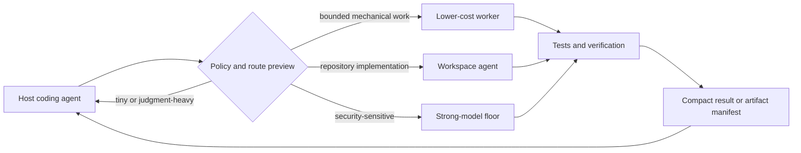

<div align="center">

# Model Orchestra

**Verified, budget-aware delegation for coding agents.**

[](docs/PUBLIC_ALPHA.md)
[](pyproject.toml)
[](model_orchestra/data/tool-schemas.v1.json)
[](tools/check.py)

</div>

Model Orchestra is an MCP server that helps a coding agent decide **whether to delegate, which model is eligible, what the call may cost, and what evidence must come back**.

Routine, bounded work can go to a cheaper worker. Repository changes stay behind a workspace-agent capability floor. Security work stays on the configured strong model by default. Architecture, review, and final acceptance remain with the host.

The goal is not "use more models." It is:

> **Preserve scarce strong-model capacity without trading away correctness, security, or spending control.**

## Why It Exists

Coding agents are usually connected to one expensive model and use it for everything: boilerplate, tests, implementation, review, and security analysis. Simple work consumes the same scarce context and quota as difficult judgment.

Model Orchestra adds a policy layer between the host and the model providers:



Routing is **capability-first**. Price only matters after a model is eligible.

## Public Alpha

The `v0.2.0a1` candidate provides:

- provider-neutral OpenAI-compatible and Anthropic-compatible endpoints;
- custom provider base URLs and environment-based credentials;
- route previews with capability and economic explanations;
- process-safe SQLite budget reservations;
- pending liabilities for uncertain provider outcomes;
- caller-owned test verification and bounded repair;
- compact batch artifact manifests;
- reproducible wheel and source distributions;
- a dependency-free stdio smoke covering discovery, read-only calls, and clean shutdown.

The alpha exposes eight stable tools:

| Tool | Purpose |
|---|---|
| `list_workers` | Inspect configured workers and routes |
| `route_preview` | Explain eligibility, model choice, and estimated economics without a model call |
| `delegate` | Run one capability- and budget-guarded task |
| `delegate_verified` | Generate Python and verify it against caller-supplied tests |
| `orchestrate_change` | Run a repository edit through the configured workspace-agent floor |
| `batch_delegate` | Run independent tasks and return a compact artifact manifest |
| `orchestration_report` | Inspect routing outcomes without exposing prompts or file contents |
| `cost_report` | Review measured tokens and configured cost estimates |

Experimental pipelines, swarms, compaction, and automatic wrappers are not exposed by the public-alpha CLI.

## Quick Start

Requires Python 3.11+ and [`uv`](https://docs.astral.sh/uv/).

Build and install the current alpha candidate:

```bash
python tools/build_release.py
python -m pip install dist/model_orchestra-0.2.0a1-py3-none-any.whl
```

Locate the packaged example configuration:

```bash
python -c "from model_orchestra.config import example_config_path; print(example_config_path())"
```

Copy that example to a user-owned path, replace the placeholder provider URLs and model IDs, and set only the credential variables named by the configuration.

Then validate the setup:

```bash
model-orchestra check --config /absolute/path/to/config.json
model-orchestra doctor --config /absolute/path/to/config.json
model-orchestra tools --config /absolute/path/to/config.json
```

Start the stdio MCP server:

```bash
model-orchestra serve --config /absolute/path/to/config.json
```

Register that command with your MCP host. A generic registration looks like:

```json
{
  "mcpServers": {
    "model-orchestra": {
      "command": "model-orchestra",
      "args": ["serve", "--config", "/absolute/path/to/config.json"]
    }
  }
}
```

See the complete [Public Alpha Guide](docs/PUBLIC_ALPHA.md) for migration, host setup, live benchmark authorization, and uninstall instructions.

## How Routing Works

| Work | Default decision | Reason |
|---|---|---|
| Typo, formatting, obvious local edit | Keep on host | Delegation overhead is larger than the task |
| Architecture, explanation, code review | Keep on host | Requires host judgment and acceptance |
| Bounded mechanical generation | Eligible lower-cost worker | Only when the configured objective and cost cap permit it |
| Repository implementation | Workspace-agent route | Needs tool authority, file edits, and host diff review |
| Security, exploit, cryptography, forensics | Strong-model route | Capability floor cannot be downgraded for price |

A route preview is local and makes no provider call:

```json
{
  "task": "Write a small parser helper",
  "agent": false,
  "max_cost_idr": 0
}
```

Call it through your MCP host with `route_preview`. The response includes eligible routes, selected models, estimate assumptions, billing mode, fallback policy, and the verification expected from the host.

## Trust Boundaries

Model Orchestra is deliberately conservative:

- **Capability beats price.** Automatic routing cannot cross the repository or security floor; direct delegation requires an explicit, audited override.
- **Budgets reserve before submission.** Concurrent processes cannot spend the same allowance.
- **Unknown billing stays reserved.** Timeouts and uncertain provider failures become pending liabilities.
- **Tests come from the caller.** A worker does not get to invent the specification it is judged against.
- **Generated code is not sandboxed.** Verification uses a temporary directory and timeout; only trusted tasks and tests should be executed.
- **The host remains accountable.** Diffs, architecture, security decisions, and final acceptance stay with the host.
- **Economic estimates are not invoices.** Cash outlay, quota usage, and strong-model capacity are reported as different concepts.

## Current Evidence

The current alpha is an **installability and policy-enforcement milestone**, not proof of universal savings.

The table below reports the current branch. Linked phase scorecards remain
point-in-time records and may show the smaller test suites that existed when each
phase closed.

| Evidence | Result |
|---|---:|
| Current branch offline suite | **97 passed**, 3 live tests deselected |
| Deterministic routing corpus | **12 / 12** |
| Alias and failover invariants | **19 workers** verified |
| Synthetic host-context reduction | **95.5%** |
| Wheel and sdist reproducibility | Byte-identical across two fixed-epoch builds |
| Windows clean install and uninstall | Pass |
| WSL2 Linux wheel and sdist install | Pass |
| Generic MCP stdio smoke | Pass, 8 tools discovered and clean shutdown |

Detailed evidence and limitations:

- [Phase 01 stabilization scorecard](release_pipeline/evidence/01-stabilize-scorecard.md)
- [Phase 02 public-alpha scorecard](release_pipeline/evidence/02-public-alpha-scorecard.md)
- [Economic deep dive](release_pipeline/evidence/00-economic-deep-dive.md)

Hermes, Claude Code, and MCP Inspector integration commands are documented, but
repeatable client-specific evidence is not yet archived. Public publication remains
gated on those client records and the first successful pushed Windows/Linux CI
matrix. Fresh real-workload savings evidence belongs to the later proof phase.

## Configuration

The public configuration separates:

- providers and credential variable names;
- worker aliases and model IDs;
- capability floors and audited overrides;
- routes and verification recipes;
- billing modes and pricing assumptions;
- provider budgets and local state paths.

Resolution order:

1. `--config`
2. `MODEL_ORCHESTRA_CONFIG`
3. `~/.config/model-orchestra/config.json`

The packaged [configuration schema](model_orchestra/data/config.schema.json) validates the stable v1 surface. The frozen [tool schema snapshot](model_orchestra/data/tool-schemas.v1.json) prevents accidental public API drift.

## Development

Run the complete zero-network release gate:

```bash
python tools/check.py
```

Individual checks:

```bash
python -m pytest
python tools/usefulness_benchmark.py --check
python tools/benchmark.py --check-baseline
python tests/test_resolve.py
python tools/snapshot_tool_schemas.py
```

Build reproducible artifacts:

```bash
python tools/build_release.py
```

Run the dependency-free stdio smoke against an installed artifact:

```bash
python tools/smoke_stdio.py \
  --config /absolute/path/to/config.json \
  -- model-orchestra serve
```

> [!WARNING]
> Live provider evaluation is never part of the default suite. It requires explicit authorization.

```bash
model-orchestra benchmark --config /absolute/path/to/config.json --live
```

## Project Status

Model Orchestra is a **public-alpha candidate**. The current focus is narrow:

1. complete the first remote CI run;
2. test the setup flow with a user who did not build the project;
3. measure accepted results, retries, host redo, quota use, and incremental cash on real work;
4. expand only after verified budget benefit is demonstrated.

The roadmap and stop-loss rules live in the [release pipeline](release_pipeline/README.md).

## License

See [LICENSE](LICENSE).
