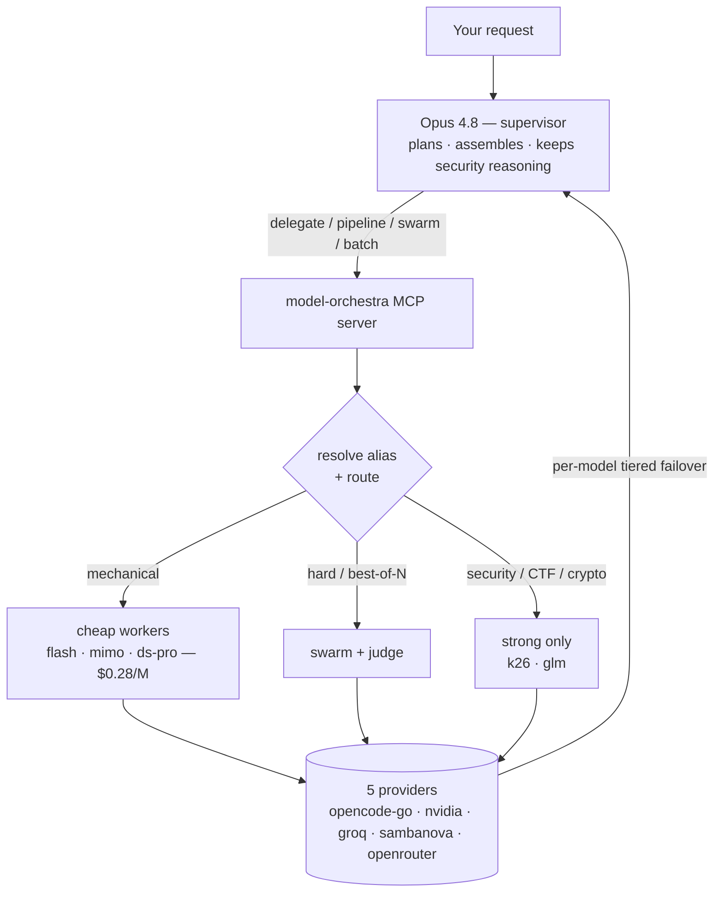
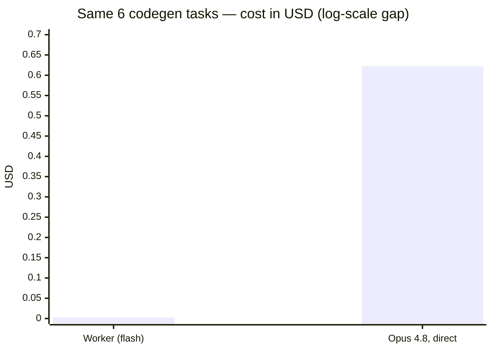
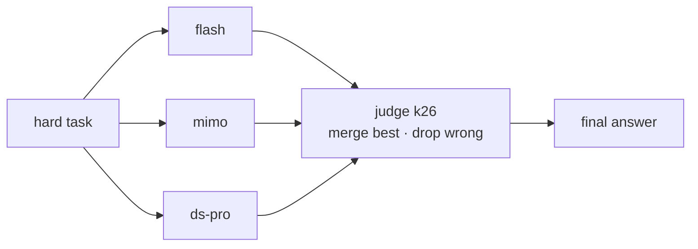
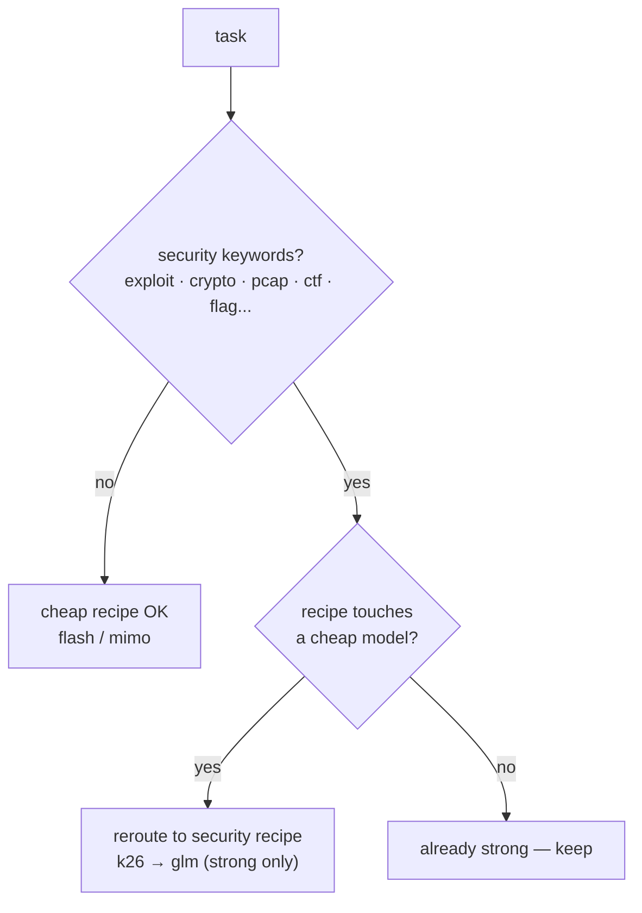

# model-orchestra

Opus 4.8 (in Claude Code) = **supervisor**. Tiny models on OpenRouter, NVIDIA,
OpenCode Go, Groq, and SambaNova = **workers**. An MCP server gives Opus a
`delegate()` tool so it plans and reviews while cheap models do the grunt work.

Why an MCP tool and not Claude Code subagents: subagents can only run Anthropic
models. Delegating to other providers has to go through a tool. This is it.



## Proof — it's measured, not claimed

Three real tests. Every number is from a live API call or a deterministic check —
rerun the scripts to reproduce.

### 1. Cost: 250× cheaper on grunt work  (`python proof.py` → [PROOF.md](PROOF.md))

Six mechanical codegen tasks sent to the cheap worker `flash`. Real token counts,
priced against the same output on Opus 4.8.



| Where the 8,880 tokens ran | Rate (in / out per 1M) | Cost |
|---|---|---|
| Worker (`flash`) | $0.28 / $0.28 | **$0.0025** |
| Opus 4.8, if it wrote it itself | $15 / $75 | $0.6224 |

**250× cheaper (99.6% saved).** The supervisor's own spend is just the tiny
delegate call, not the bulk generation.

### 2. Lossless: cheap workers are 100% correct  (`python benchmark.py` → [REPORT.md](REPORT.md))

Six coding tasks (atoi clamping, RPN truncation, decode-ways edge cases…),
**verified by executing the generated code against unit tests** — not by eyeballing.

| | Pass rate | Verified by |
|---|---|---|
| Single cheap worker (`flash`) | **6/6** | real unit tests |
| Swarm (`flash, mimo, ds-pro`) | **6/6** | real unit tests |

A single cheap worker already nails the whole set, so handing it mechanical work
costs nothing in quality — which is exactly what makes proof #1 safe. The swarm is
best-of-N *insurance* for genuinely hard problems, not for easy grunt work:



### 3. Safe: security work never routes cheap  (deterministic guard)

`exploit / crypto / pcap / ctf / flag{…}` and friends are auto-detected. Any recipe
that would touch a cheap model is rerouted to the strong-only `security` recipe
(`k26 → glm`). Verified: all 4 sample security tasks flag, all 3 mechanical tasks
don't, and the reroute lands on strong models every time.



## Setup

1. **Keys** — copy `.env.example` to `.env`, fill in your keys:
   ```
   OPENROUTER_API_KEY=...
   NVIDIA_API_KEY=...
   OPENCODE_API_KEY=...
   GROQ_API_KEY=...
   SAMBANOVA_API_KEY=...
   ```
   (You don't need all of them — the server only complains about a provider when
   a worker on it is actually called. Groq and SambaNova are free tiers.)

2. **Deps** — `pip install -r requirements.txt`

3. **Test routing** — `python test_resolve.py` should print `ok`.

4. **Register with Claude Code** (user scope = available in every project):
   ```
   claude mcp add -s user model-orchestra -- python "/absolute/path/to/model-orchestra/server.py"
   ```
   Or just run Claude Code from this folder — `.mcp.json` here is picked up
   automatically. Restart Claude Code, then `/mcp` should list `model-orchestra`.

5. **Make Opus supervise** — `CLAUDE.md` in this folder tells Opus to delegate.
   Working in another project? Copy that block into that project's `CLAUDE.md`,
   or just tell Opus: "delegate grunt work via the model-orchestra tools."

## Reproduce the proof

```
python proof.py        # cost proof     -> PROOF.md
python benchmark.py    # lossless proof -> REPORT.md
python diagnose_workers.py   # which of the 16 workers are up right now
```

## Editing workers

`config.json` → `workers` maps short aliases to `provider/model-id`. Change the
model ids to whatever your accounts actually have. Format is always
`provider/<the id that provider expects>`. Get real ids from:
- OpenRouter: https://openrouter.ai/models
- NVIDIA: https://build.nvidia.com/models
- OpenCode Go: https://opencode.ai/zen/go/v1/models

## Two modes of `delegate`

- `agent=False` (default) — one prompt in, one text answer out. Cheap and fast.
- `agent=True` — the worker gets read_file / write_file / run_shell tools and
  loops in a `workspace` dir. Needs a tool-calling model (use `k26`).

## Security note

Agent mode lets a worker model run shell commands in its workspace (that's the
point of agentic coding). Only point it at directories you're OK with it
touching. No sandbox — add one (container / command allowlist) if you delegate
untrusted tasks.
