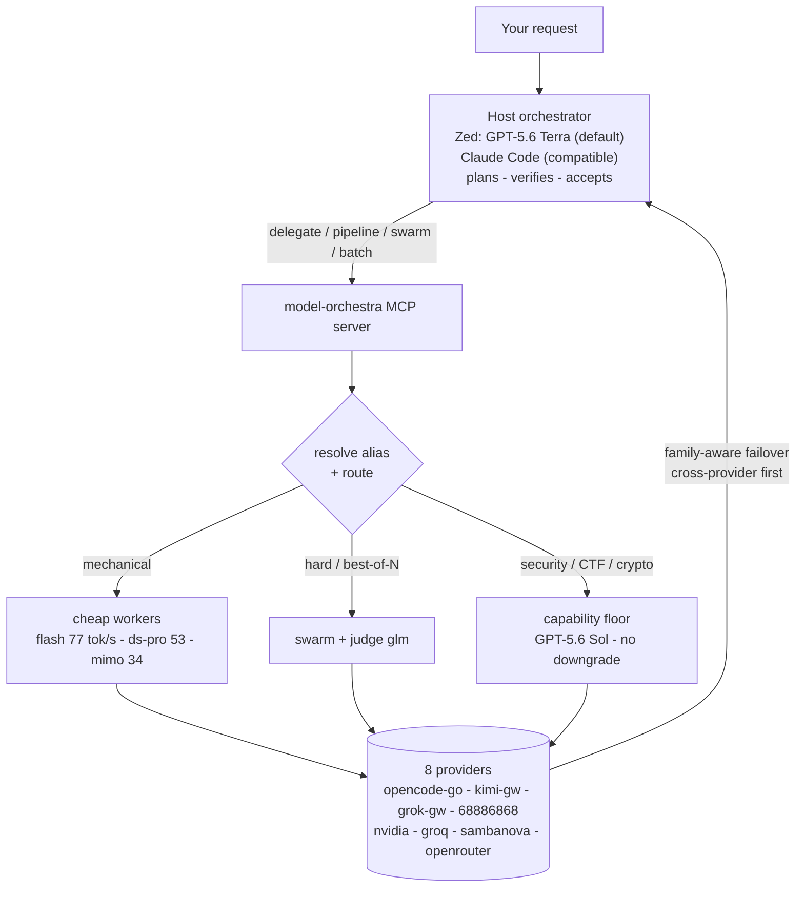
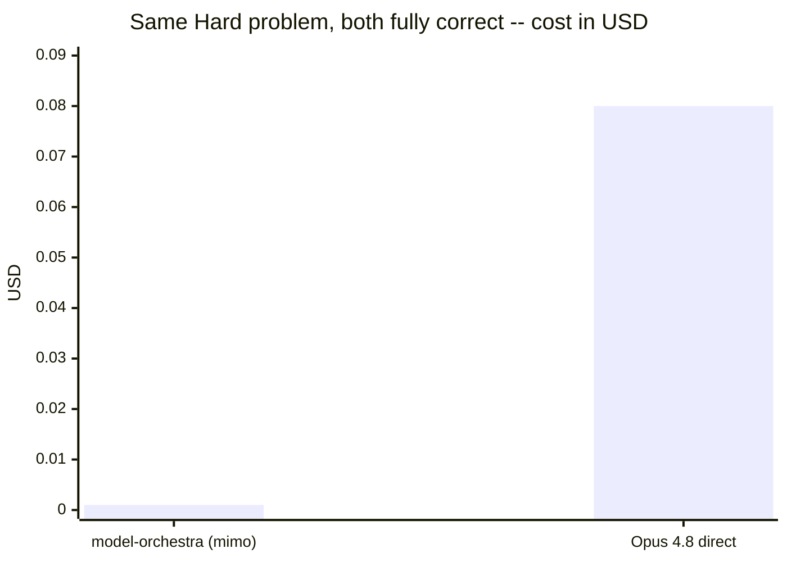
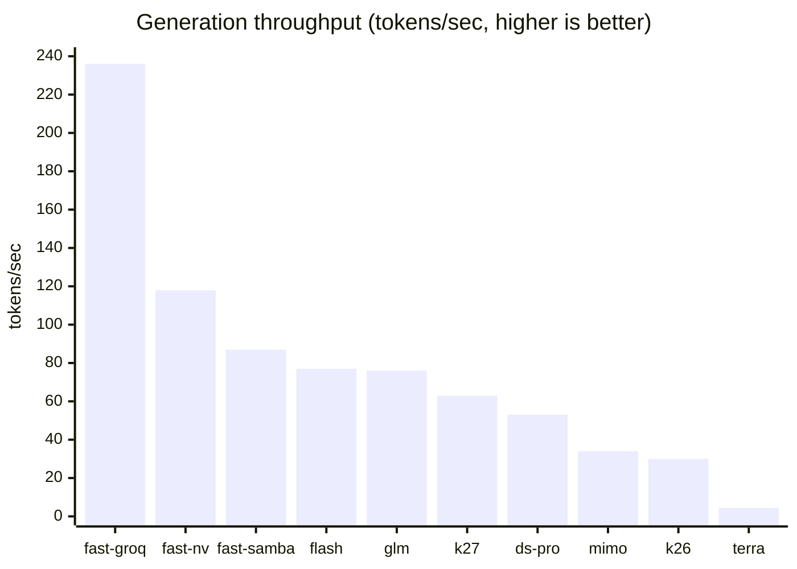
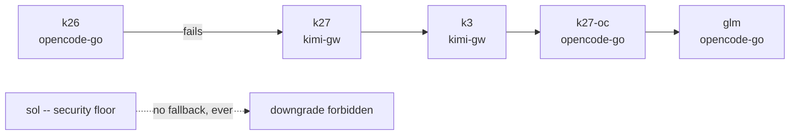
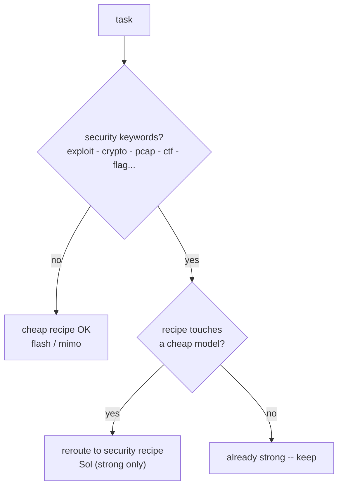

# model-orchestra

**Primary orchestrator:** Zed with GPT-5.6 Terra for general work and GPT-5.6
Sol for security-sensitive reasoning. **Compatible secondary host:** Claude Code.
Tiny models on OpenRouter, NVIDIA, OpenCode Go, Groq, and SambaNova = **workers**.
An MCP server lets the host plan and review while cheaper models handle bounded
mechanical work.

Zed selects GPT-5.6 Terra as the default host model in its assistant settings.
`AGENTS.md` supplies the orchestrator behavior instructions. `.mcp.json`
registers the model-orchestra MCP tools; it cannot and does not select the host
model.

Why an MCP tool and not native subagents: subagents can only run the vendor's
own models. Delegating to other providers has to go through a tool. This is it.



**19 worker aliases across 8 providers.** Generation caps, budget envelopes, swarm
size, batch size, judge input, and a wall-clock deadline on every call are all
bounded in `config.json`.

## Measured results

All numbers below come from live API calls on 2026-07-21, verified by executing the
generated code. Aliases, prices, and provider speeds change -- rerun before trusting
them for a current decision.

### 1. Head-to-head: same Hard problem, Opus 4.8 vs a cheap worker

LeetCode 4 (Median of Two Sorted Arrays) -- Hard, with a strict O(log(m+n))
requirement so a lazy merge-and-sort is detectable. 52 shared cases: empty arrays,
duplicates, negatives, wildly uneven lengths, plus randomized fuzz.

| | Correct | Took the merge+sort shortcut | Cost |
|---|---|---|---|
| **Opus 4.8**, written directly | **52/52** | no | ~$0.08 host-equivalent |
| **model-orchestra** (`mimo`) | **52/52** | no | 16 IDR (~$0.001) |



**~80x cheaper at identical correctness.** The saving is real but scales with
*delegated volume* -- if the host does the work itself, it saves nothing.

### 2. Quality: 5/6 typical, and it is the token cap that decides

`python tests/test_quality.py` executes every generated artifact against real checks.

| `worker_max_tokens` / `judge_max_tokens` | Pipeline quality |
|---|---|
| 1024 / 1536 | **1/6** -- workers truncated mid-function; judges then described the fragments |
| 3072 / 4096 | **5/6 typical (4-6/6 across runs)** |

`max_tokens` is a **cap, not a charge** -- a short answer costs the same either way.
Lowering it saves almost nothing and silently guts output. A startup assertion now
refuses to boot below 2048. Runs vary because `speed-run` is nondeterministic; the
one task that flaps is usually the *easiest*, not the hardest.

### 3. Speed: model choice dominates, not code

Measured throughput, identical 1500-token generation per worker:



`draft-refine` used to default to `mimo` (34 tok/s, second-slowest) with `k26` (30
tok/s, slowest) judging every swarm. Both now route to `flash`/`glm` (~77/76 tok/s)
at the same cost and strength tier. **Never route a hot path through `terra` -- at
4.4 tok/s it is ~17x slower than `flash`.**

Three latency bugs fixed, each measured:

| Fix | Before | After |
|---|---|---|
| `request_timeout` 60s was aborting live generations, forcing retries | 181s, 3 attempts | **52.9s, 0 retries** |
| `compact()` summarized chunks serially | 3.0s / 10 chunks | **0.90s (3.3x)** |
| Retry+failover had no wall-clock bound | ~27 min worst case | **bounded, verified 13.6s** |

### 4. Cost: prompt caching is on

Gateway system prompts ship as cacheable blocks, billed at the ~10x cheaper
`cached_input` rate. Measured **92% of prompt volume served from cache**. Cache
*writes* are tracked too -- they carry a premium, so ignoring them would understate
real spend. `cost_report()` shows the hit rate plus a host-equivalent estimate.

### 5. Failover: same family, different provider first

Several models exist on more than one provider, so a failure hops provider before it
hops model -- the usual cause is the provider being down, not the model.



Every chain must leave its home provider at some point, so a whole-provider outage is
survivable; `tests/test_resolve.py` asserts this. `sol` keeps an empty chain on
purpose -- a silent downgrade on security work trades correctness for uptime.

### 6. Safe: security work never routes cheap  (deterministic guard)

`exploit / crypto / pcap / ctf / flag{...}` and friends are auto-detected. Any recipe
that would touch a cheap model is rerouted to the strong-only `security` recipe
(`sol`). Verified: security tasks stay on Sol and mechanical tasks stay eligible for
cheap workers.



## Setup

1. **Install dependencies** -- `python -m pip install -r requirements.txt`

2. **Run the local setup wizard** -- `python tools/setup_model_orchestra.py`
   It prompts with hidden input, writes only to the ignored `.env`, preserves
   unrelated variables, and installs the Zed profile. Use
   `python tools/setup_model_orchestra.py --gateway-only` if you only need the three
   gateway keys. Never paste credentials into chat or commit `.env`.

3. **Test routing** -- `python tests/test_resolve.py` should print `ok`.

4. **Register the MCP server**

   **Zed (primary)** -- the setup wizard installs the `Model Orchestra` profile
   and registers this project's `.mcp.json` MCP server. The profile defaults to
   `c-lite-1 / gpt-5.6-terra`. Zed loads `AGENTS.md` from the project root as the
   orchestrator instructions. The `.mcp.json` only exposes tools; it cannot select
   the host model or populate Zed's keychain.

   **Model Orchestra Auto (optional external agent)** -- install the ACP router:
   ```sh
   python tools/configure_zed_profile.py --install-auto-router
   ```
   Restart Zed, open a new Agent thread, and select `Model Orchestra Auto` from
   the external-agent selector. Its Model control exposes `Auto`, `GPT-5.6 Terra`,
   and `GPT-5.6 Sol`. Auto chooses Terra for normal prompts and Sol for security,
   CTF, cryptography, malware, and forensics prompts, then pins that model for
   the thread. The external agent uses the `.env` gateway keys and Zed's permission
   prompts for file writes and terminal commands. Zed Agent Profiles, Skills, and
   MCP tools do not automatically carry into an ACP external agent.

   **Claude Code (compatible secondary)** -- register globally:
   ```
   claude mcp add -s user model-orchestra -- python "/absolute/path/to/model-orchestra/server.py"
   ```
   Or just run Claude Code from this folder -- `.mcp.json` here is picked up
   automatically. Restart Claude Code, then `/mcp` should list `model-orchestra`.

5. **Apply the host policy** -- Zed reads `AGENTS.md`; Claude Code reads
   `CLAUDE.md`. Both choose delegation only when it saves net context or adds
   useful review diversity.

## Token policy

- Handle trivial questions and small edits directly.
- Use one worker for bounded mechanical work; use batches only for substantial,
  independent tasks and swarms only when uncertainty or impact justifies them.
- Pass targeted excerpts instead of full conversations or repository dumps.
- Treat context overflow as permanent for that payload; reduce it before retrying.
- Keep routine completion reports to changes, validation, and material risks.

Runtime limits in `config.json` bound generation tokens, agent steps, swarm size,
batch size, judge input, and returned text.

## Rp340k budget plan

The configured budget is deliberately split: **Rp185,000 for OpenCode Go** and
**Rp155,000 for the chicken-farm gateway**. They are tracked independently in the
ignored `.model-orchestra-budget.json` ledger, so one provider cannot consume the
other's allocation. The guard uses monthly, daily, and rolling 5-hour limits and
blocks a request before its maximum configured output could cross the limit.

| Provider | Month | Day | Rolling 5 hours | Use it for |
|---|---:|---:|---:|---|
| OpenCode Go | Rp185,000 | Rp6,200 | Rp2,100 | Default coding, tests, compacting, drafts |
| Chicken farm | Rp155,000 | Rp5,200 | Rp1,750 | Terra/Sol, Kimi, and Grok only when their capability is needed |

The model selection is intentionally asymmetric. The repository's historical
benchmark recorded **6/6 passing mechanical coding tasks** with one Flash worker;
the three-worker swarm had the same 6/6 result while using roughly three times the
worker calls. Therefore `speed-run`, `debug`, and routine `draft-refine` stay on
OpenCode models. Use `swarm-budget`, `deep-plan`, or premium models only for an
explicit high-risk task. Security, CTF, cryptography, malware, and forensics remain
Sol-only, but each call is bounded to `worker_max_tokens` output tokens and cannot
exceed the chicken-farm envelope.

The chicken-farm model estimates use the screenshot's discounted key-group prices
and a configurable `hkd_to_idr: 2100` conversion. Update that conversion or the
per-model rates in `config.json` if the provider changes pricing. `cost_report()`
shows token usage plus the configured budget estimates; it is not an invoice.

## Model selection

| Task class | Default | Reason |
|---|---|---|
| Formatting, boilerplate, simple tests | Flash or MiMo | Lowest-cost bounded generation |
| Normal coding and debugging | MiMo/Flash then K2.6 review | Cheap draft with stronger verification |
| Architecture and code review | GLM-5.2 or the configured review pipeline | More judgment without paying for Sol |
| General high-capability host work | GPT-5.6 Terra | Better cost/capability balance |
| CybSec, exploit, cryptography, malware, forensics | GPT-5.6 Sol | Strict quality floor; no model downgrade |

This is a capability estimate, not a billing estimate: provider prices and model
behavior are not available from local configuration. Measure representative tasks
before assigning cost claims.

## Activating the ported skills in Zed

The setup wizard installs the `Model Orchestra` Zed Agent profile and the
secret-free `c-lite-1`, `c-lite-2`, and `c-pro` provider catalog:

```sh
python tools/setup_model_orchestra.py
```

For an existing environment where only the profile needs repair, run
`python tools/configure_zed_profile.py` directly.

Open a new Zed Agent thread, select `Model Orchestra` from the profile selector,
and keep the profile's default `c-lite-1 / gpt-5.6-terra` model selected. The
installer also registers `c-lite-2` and `c-pro`, each with Terra and Sol. Zed
stores each provider key in the system keychain and does not support automatic
cross-provider fallback; select `c-lite-2` or `c-pro` manually if the host fails.

For model-orchestra calls, configure these environment variables in order:

```text
C_LITE_1_API_KEY=...
C_LITE_2_API_KEY=...
C_PRO_API_KEY=...
```

The MCP server automatically tries those keys in that order. Security tasks use
Sol and do not downgrade to another model; general gateway work uses Terra. These
variables configure MCP worker/delegation calls, not Zed's host keychain.
This enables the normal coding tools and all eight `model-orchestra` MCP tools.
It is a Zed Agent profile, so it appears in the Agent Panel profile selector, not
under Settings > AI > External Agents (which lists separate ACP processes).

The enabled Claude Code workflows have Zed Agent Skill equivalents under
`~/.agents/skills`. Start a new Agent Panel thread after adding or repairing a
skill; Zed selects matching skills from their descriptions. For deterministic
activation, add a skill with `@` in the message editor or choose it from Zed's
skill picker. Reload the Zed window only if the profile or a new skill is still
missing, or an old load warning persists.

Agent Skills and MCP tools are independent: skills provide focused instructions,
while the `model-orchestra` context server provides `delegate`, `batch_delegate`,
`pipeline`, and `swarm`. Claude-only lifecycle hooks and plugin manifests do not
run in Zed, so hook-derived workflows such as security review or bounded iteration
must be invoked explicitly. See [docs/PLUGIN_PORTABILITY_REPORT.md](docs/PLUGIN_PORTABILITY_REPORT.md)
for the complete 18-plugin matrix and cost methodology.

Audit the local installation without reading or printing secrets:

```sh
python tools/plugin_portability.py
```

## Reproduce the proof

```sh
python tests/test_resolve.py       # routing + failover invariants (no API calls)
python tests/test_safety.py        # 34 deterministic safety checks (no API calls)
python tests/test_quality.py       # executes generated code -- the 5/6 number above
python tools/diagnose_workers.py   # which of the 19 workers are up right now
python tools/proof.py              # priced token snapshot -> docs/PROOF.md
python tools/benchmark.py          # correctness snapshot  -> docs/REPORT.md
```

The first two need no credentials and no network -- run them after any config change.
`test_quality.py` makes real calls and costs real tokens. The throughput and
head-to-head figures above were one-off measurements, not checked-in scripts; treat
them as dated evidence, not a regression suite.

New reports record their UTC generation time, configuration hash, and resolved model
identifiers. `tools/proof.py` also records a dated manual pricing snapshot and stops if the
priced worker alias resolves to a different model. Verify provider pricing before each
run; `cost_report()` only reports worker token usage and does not calculate billed cost.

## Failover and prompt caching

`model_fallbacks` in `config.json` is **family-aware and cross-provider first**.
Several models are served by more than one provider (`kimi-k2.7-code` and
`grok-4.5` exist on both OpenCode Go and the gateway), so a failing model hops to
the same family on a *different* provider before anything else — the usual cause
of failure is the provider being down, not the model.

| Model | Failover chain |
|---|---|
| `k26` (OpenCode) | `k27` -> `k3` (gateway kimi) -> `k27-oc` -> `glm` |
| `terra` | `luna` -> `sol` -> `k26` -> `glm` |
| `grok` (gateway) | `grok-oc` (OpenCode twin) -> `glm` -> `k26` |
| `sol` | **none, by design** — the security floor must never silently downgrade |

Every chain is required to leave its home provider at some point, so a whole
provider outage is survivable; `python tests/test_resolve.py` asserts this.

Gateway calls send the system prompt as a cacheable block, so repeated recipes
bill input at the ~10x cheaper `cached_input` rate. `cost_report()` shows the
cache hit rate and the tokens written to cache.

> Generation caps (`worker_max_tokens`, `judge_max_tokens`) have a hard floor of
> 2048. Measured: at 1024/1536 the execution-checked suite scores **1/6** because
> workers get truncated mid-function; at 3072/4096 it scores **6/6**. `max_tokens`
> is a cap, not a charge — lowering it saves almost nothing and guts quality.
> Spend is bounded by the budget guard, never by starving generation.

## Editing workers

`config.json` -> `workers` maps short aliases to `provider/model-id`. Change the
model ids to whatever your accounts actually have. Format is always
`provider/<the id that provider expects>`. Get real ids from:
- OpenRouter: https://openrouter.ai/models
- NVIDIA: https://build.nvidia.com/models
- OpenCode Go: https://opencode.ai/zen/go/v1/models

## Two modes of `delegate`

- `agent=False` (default) -- one prompt in, one text answer out. Cheap and fast.
- `agent=True` -- the worker gets workspace-scoped `read_file` and `write_file`
  tools and loops in a `workspace` directory. It needs a tool-calling model.

## Agent shell policy

Worker shell access is disabled by default with `agent_shell_mode: "deny"` in
`config.json`; `run_shell` is not advertised to workers in this mode.

- `deny` -- file tools only. This is the default.
- `allowlist` -- set `agent_shell_allowlist` to trusted native executable names.
  Commands run with `shell=False`; shell wrappers, composition, redirection,
  absolute paths, and `..` path segments are rejected. Executables resolve to
  absolute paths when the server starts, preventing workspace shadowing.
- `unrestricted` -- explicit trusted-local escape hatch using the platform shell.

An executable allowlist is a guardrail, not a filesystem sandbox. Interpreters,
package managers, build tools, and many version-control commands can execute code or
access files outside the workspace. Use a container or OS sandbox for untrusted tasks,
and only point agent mode at directories the worker is allowed to modify.
